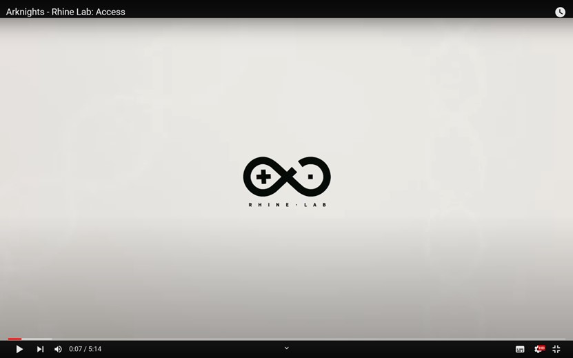
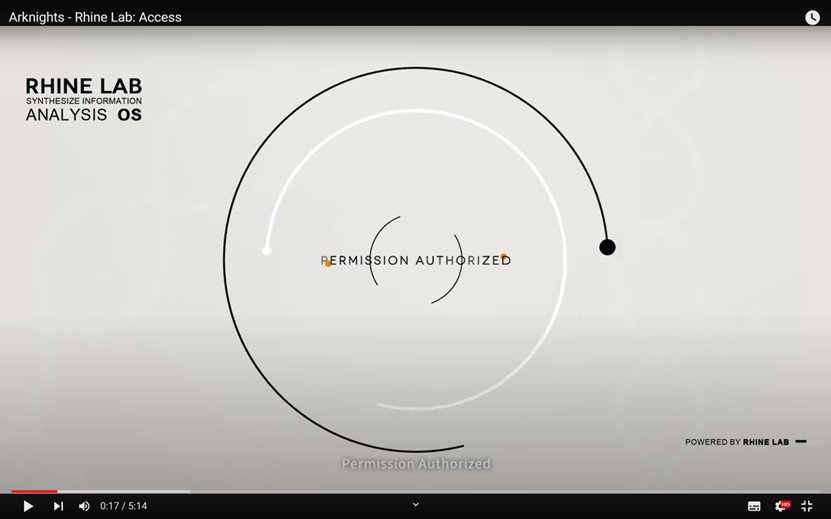
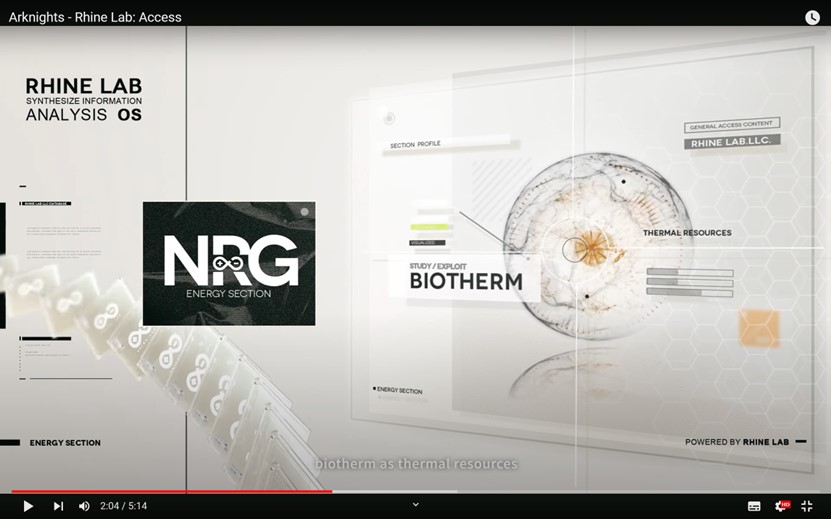
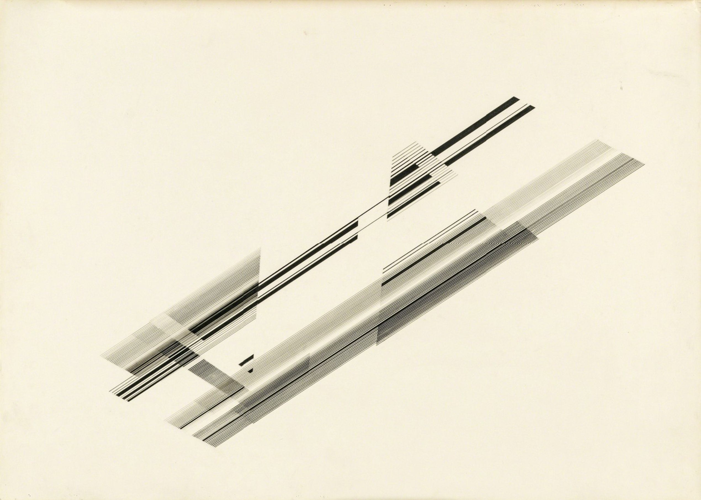

# yzha0622_9103_tut6
## Quiz 8
---
### Part 1: Imaging Technique Inspiration

[Resource: a video introducing Rhine Lab in the game *Arknights*.](https://www.youtube.com/watch?v=-_HeLFGCw7M)
The art style of this video is composed of simple graphics, lines and concise and straightforward 3D models, which are informative and inspiring and very similar to the works of Nasreen Mohamedi.
Many parts of the video animate simple points, lines and blocks, making them more flexible through rotation, translation and flashing. For example, the logo display at the beginning **(Figure 1)**, the animation of permission authorized **(Figure 2)**, etc. There are also many processes such as projection, blurring and transparency changes, which give flat things a 3D effect **(Figure 3)**.

>
>**Figure 1** - Logo of Rhine Lab

>
>**Figure 2** - Animation of Rermission Authorized

>
>**Figure 3** - Department Introduction
---
### Part 2: Coding Technique Exploration
[Resource: "Intertwined" by Joe DeNavas (DD89) from p5.js Tutorials](https://openprocessing.org/sketch/2187000)
```js
let timer=0

function setup() 
{
	createCanvas(windowWidth, windowHeight,WEBGL);
	background(100);
}

function draw() 
{
	rotateX(timer/90)
	rotateY(timer/20)
	rotateZ(timer/90)
	timer++
	for(x=-50;x<50;x++)//creates grid - X axis coordinates
	{
		for(y=-50;y<50;y++)//creates grid - Y axis coordinates
		{
			push()
			for(z=0;z<10;z++)
			{
				translate(x*20,y*20,0)
			}
			if(timer%10==0 && timer<61) //creates spheres
			{
				 if(x==0 & y==0) stroke(random(255),random(255),random(255),200)
				 else if(x==0 & y==1 & timer<30) stroke(random(255),random(255),random(255),200)
				 else if(x==0 & y==-1 & timer<30) stroke(random(255),random(255),random(255),200)
				 else stroke(0)
				 sphere(random(25))
			}
			else if(timer>=61 && timer<77) //creates touch of light at top right corner at end of sketch
			{
				stroke(random(255),20)
				noFill()
				translate(200,100,-500)
				strokeWeight(.5)
				for(i=0;i<3;i++)
				{
					rotateX(timer*4)
					box(x*15,-900+x*15,10)
				}
			}
			else if(timer<77) //creates giant circles/rings around the spheres
			{
			 if(x==0&y==0) stroke(random(255),random(255),random(255),200)
			 else if(x==0 & y==1 & timer<30) stroke(random(255),random(255),random(255),200)
			 else if(x==0 & y==-1 & timer<30) stroke(random(255),random(255),random(255),200)
			 else stroke(0)
			 strokeWeight(.5);
			 noFill();
			 circle(0,0,200)
			}
			pop()
		}
	}
}
```
This is a coding technique called "Intertwined" **(Figure 4)**. It can help animate an artwork like Nasreen Mohamedi's "Untitled-1" **(Figure 5)** by allowing dynamic manipulation of lines and shapes through rotations and translations. By applying rotations on the X, Y, and Z axes, the static, precise lines of Mohamedi's work could be transformed into a living, moving 3D space. The layering and interaction of lines in the code could simulate the overlapping and intersecting lines in the artwork. Moreover, the controlled chaos of shapes appearing and disappearing can bring an energetic dimension to the calm precision typical of Mohamedi's style.

>
>**Figure 4** - "Intertwined" by Joe DeNavas (DD89)

>
>**Figure 5** - "Untitled-1" by Nasreen Mohamedi 
